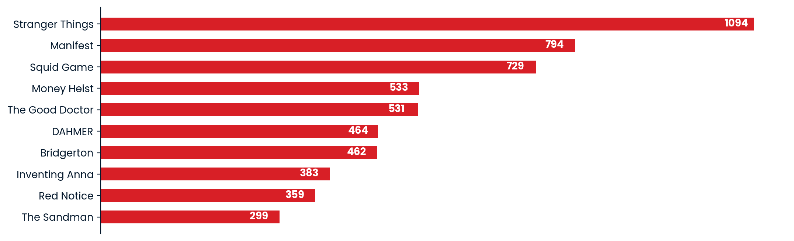

# Netflix top shows database<a id="title"></a>


<br/>
<p style="text-align:justify">
Founded in 1997 as a movie rental company, <a href= "https://www.netflix.com/browse"><strong>Netflix</strong></a> made a pivotal change in its marketing strategy in the year 2007 when its founders, <strong>Reed Hastings</strong> and <strong>Marc Randolph</strong>, decided to reinvent the company and focus on online video streaming. Since then, the company has remained as one of the top players in the industry, having an estimated <strong>yearly economic net profit</strong> of <em>373.4 million USD</em> and <em>1850 million USD</em> in <strong>social capital</strong>.
<br/>
<br/>	
Through the querying of the <strong>Competition Netflix Top 10</strong> PostgreSQL database, this analysis focuses on retrieving a series of relevant indicators, summary tables and plots from Netflix's 2021 and 2022 top shows data, as well as a mockup table of Netflix employees.
</p>

## Table of contents
[Weekly show rankings](#rankings)
<br/>
- [Table head](#head)
- [Unique years](#years)
- [Number of shows and countries](#nums)
- [Most frequent shows in the top 3 (>100 occurrences)](#>100)
- [Top 10 most frequent shows in the top 10](#top10)

[Netflix empoyees by role and department](#employees)

## Weekly show rankings<a id="rankings"></a>

### Table head<a id="head"></a>


```python
SELECT *
FROM all_weeks_countries
LIMIT 5;
```


<div>
<style scoped>
    .dataframe tbody tr th:only-of-type {
        vertical-align: middle;
    }

    .dataframe tbody tr th {
        vertical-align: top;
    }

    .dataframe thead th {
        text-align: right;
    }
</style>
<table border="1" class="dataframe">
  <thead>
    <tr style="text-align: right;">
      <th></th>
      <th>country_name</th>
      <th>country_iso2</th>
      <th>week</th>
      <th>category</th>
      <th>weekly_rank</th>
      <th>show_title</th>
      <th>season_title</th>
      <th>cumulative_weeks_in_top_10</th>
    </tr>
  </thead>
  <tbody>
    <tr>
      <th>0</th>
      <td>Argentina</td>
      <td>AR</td>
      <td>2022-12-04 00:00:00+00:00</td>
      <td>Films</td>
      <td>1</td>
      <td>Troll</td>
      <td>N/A</td>
      <td>1</td>
    </tr>
    <tr>
      <th>1</th>
      <td>Argentina</td>
      <td>AR</td>
      <td>2022-12-04 00:00:00+00:00</td>
      <td>Films</td>
      <td>2</td>
      <td>My Name Is Vendetta</td>
      <td>N/A</td>
      <td>1</td>
    </tr>
    <tr>
      <th>2</th>
      <td>Argentina</td>
      <td>AR</td>
      <td>2022-12-04 00:00:00+00:00</td>
      <td>Films</td>
      <td>3</td>
      <td>The Swimmers</td>
      <td>N/A</td>
      <td>2</td>
    </tr>
    <tr>
      <th>3</th>
      <td>Argentina</td>
      <td>AR</td>
      <td>2022-12-04 00:00:00+00:00</td>
      <td>Films</td>
      <td>4</td>
      <td>Lady Chatterley's Lover</td>
      <td>N/A</td>
      <td>1</td>
    </tr>
    <tr>
      <th>4</th>
      <td>Argentina</td>
      <td>AR</td>
      <td>2022-12-04 00:00:00+00:00</td>
      <td>Films</td>
      <td>5</td>
      <td>Hunter Killer</td>
      <td>N/A</td>
      <td>1</td>
    </tr>
  </tbody>
</table>
</div>


### Unique years<a id="years"></a>


```python
WITH years AS (
	SELECT DISTINCT EXTRACT(YEAR FROM week) as year
	FROM all_weeks_countries
)

SELECT STRING_AGG(year :: TEXT, ', ') as years
FROM years;
```


<div>
<style scoped>
    .dataframe tbody tr th:only-of-type {
        vertical-align: middle;
    }

    .dataframe tbody tr th {
        vertical-align: top;
    }

    .dataframe thead th {
        text-align: right;
    }
</style>
<table border="1" class="dataframe">
  <thead>
    <tr style="text-align: right;">
      <th></th>
      <th>years</th>
    </tr>
  </thead>
  <tbody>
    <tr>
      <th>0</th>
      <td>2021, 2022</td>
    </tr>
  </tbody>
</table>
</div>


### Number of shows and countries<a id="nums"></a>


```python
SELECT COUNT(DISTINCT show_title) AS num_shows
FROM all_weeks_countries;
```


<div>
<style scoped>
    .dataframe tbody tr th:only-of-type {
        vertical-align: middle;
    }

    .dataframe tbody tr th {
        vertical-align: top;
    }

    .dataframe thead th {
        text-align: right;
    }
</style>
<table border="1" class="dataframe">
  <thead>
    <tr style="text-align: right;">
      <th></th>
      <th>num_shows</th>
    </tr>
  </thead>
  <tbody>
    <tr>
      <th>0</th>
      <td>4101</td>
    </tr>
  </tbody>
</table>
</div>


```python
SELECT COUNT(DISTINCT country_name) AS num_countries
FROM all_weeks_countries;
```


<div>
<style scoped>
    .dataframe tbody tr th:only-of-type {
        vertical-align: middle;
    }

    .dataframe tbody tr th {
        vertical-align: top;
    }

    .dataframe thead th {
        text-align: right;
    }
</style>
<table border="1" class="dataframe">
  <thead>
    <tr style="text-align: right;">
      <th></th>
      <th>num_countries</th>
    </tr>
  </thead>
  <tbody>
    <tr>
      <th>0</th>
      <td>94</td>
    </tr>
  </tbody>
</table>
</div>


### Most frequent shows in the top 3 (> 100 occurrences)<a id=">100"></a>


```python
WITH top_3 AS (
	
	SELECT
		country_name AS country,
		EXTRACT(YEAR FROM week) AS year,
		category,
		show_title as title,
		COUNT(show_title) OVER (
			PARTITION BY
				show_title,
				EXTRACT(YEAR FROM week)) as title_count
	
	FROM all_weeks_countries
	
	WHERE
		weekly_rank <= 3
)

SELECT

	DISTINCT title,
	year,
	title_count
	
FROM top_3
WHERE title_count > 100
ORDER BY title_count DESC;
```


<div>
<style scoped>
    .dataframe tbody tr th:only-of-type {
        vertical-align: middle;
    }

    .dataframe tbody tr th {
        vertical-align: top;
    }

    .dataframe thead th {
        text-align: right;
    }
</style>
<table border="1" class="dataframe">
  <thead>
    <tr style="text-align: right;">
      <th></th>
      <th>title</th>
      <th>year</th>
      <th>title_count</th>
    </tr>
  </thead>
  <tbody>
    <tr>
      <th>0</th>
      <td>Stranger Things</td>
      <td>2022</td>
      <td>1094</td>
    </tr>
    <tr>
      <th>1</th>
      <td>Manifest</td>
      <td>2022</td>
      <td>794</td>
    </tr>
    <tr>
      <th>2</th>
      <td>Squid Game</td>
      <td>2021</td>
      <td>729</td>
    </tr>
    <tr>
      <th>3</th>
      <td>Money Heist</td>
      <td>2021</td>
      <td>533</td>
    </tr>
    <tr>
      <th>4</th>
      <td>The Good Doctor</td>
      <td>2021</td>
      <td>531</td>
    </tr>
    <tr>
      <th>...</th>
      <td>...</td>
      <td>...</td>
      <td>...</td>
    </tr>
    <tr>
      <th>109</th>
      <td>Blonde</td>
      <td>2022</td>
      <td>103</td>
    </tr>
    <tr>
      <th>110</th>
      <td>The Snitch Cartel: Origins</td>
      <td>2021</td>
      <td>103</td>
    </tr>
    <tr>
      <th>111</th>
      <td>Furioza</td>
      <td>2022</td>
      <td>103</td>
    </tr>
    <tr>
      <th>112</th>
      <td>Stay Close</td>
      <td>2022</td>
      <td>102</td>
    </tr>
    <tr>
      <th>113</th>
      <td>The Takedown</td>
      <td>2022</td>
      <td>101</td>
    </tr>
  </tbody>
</table>
<p>114 rows × 3 columns</p>
</div>


### Top 10 most frequent shows in the top 3<a id="top10"></a>


```python
import pandas as pd
from matplotlib import pyplot as plt

fig, ax = plt.subplots(figsize = (12, 4))

bars = plt.barh(
    data = top_shows.head(10).sort_values(by='title_count'),
    y = 'title',
    width = 'title_count',
    height = 0.6,
    color = '#D81F26')

for bar in bars:
    x_val = bar.get_width()
    y_val = bar.get_y() + bar.get_height() / 2
    ax.text(
        y = y_val,
        x = x_val - 50,
        s = f'{x_val}',
        va = 'center',
        color = 'white',
        fontweight = 'bold')

ax.spines['top'].set_visible(False)
ax.spines['right'].set_visible(False)
ax.spines['bottom'].set_visible(False)
ax.get_xaxis().set_visible(False)
```


    

    


## Netflix employees by role and department<a id="employees"></a>


```python
SELECT
	COALESCE(role, 'All') AS role,
	COALESCE(department_name, 'All') AS department,
	COUNT(*) as employee_count

FROM
	employees AS e
	INNER JOIN
	departments AS d
	USING (department_id)
	
GROUP BY CUBE(department_name, role)
ORDER BY employee_count, department;
```


<div>
<style scoped>
    .dataframe tbody tr th:only-of-type {
        vertical-align: middle;
    }

    .dataframe tbody tr th {
        vertical-align: top;
    }

    .dataframe thead th {
        text-align: right;
    }
</style>
<table border="1" class="dataframe">
  <thead>
    <tr style="text-align: right;">
      <th></th>
      <th>role</th>
      <th>department</th>
      <th>employee_count</th>
    </tr>
  </thead>
  <tbody>
    <tr>
      <th>0</th>
      <td>Developer</td>
      <td>Engineering</td>
      <td>1</td>
    </tr>
    <tr>
      <th>1</th>
      <td>Manager</td>
      <td>Engineering</td>
      <td>1</td>
    </tr>
    <tr>
      <th>2</th>
      <td>Manager</td>
      <td>Marketing</td>
      <td>1</td>
    </tr>
    <tr>
      <th>3</th>
      <td>Developer</td>
      <td>Marketing</td>
      <td>1</td>
    </tr>
    <tr>
      <th>4</th>
      <td>Developer</td>
      <td>All</td>
      <td>2</td>
    </tr>
    <tr>
      <th>5</th>
      <td>Manager</td>
      <td>All</td>
      <td>2</td>
    </tr>
    <tr>
      <th>6</th>
      <td>All</td>
      <td>Engineering</td>
      <td>2</td>
    </tr>
    <tr>
      <th>7</th>
      <td>All</td>
      <td>Marketing</td>
      <td>2</td>
    </tr>
    <tr>
      <th>8</th>
      <td>All</td>
      <td>All</td>
      <td>4</td>
    </tr>
  </tbody>
</table>
</div>


[Go back up](#title)
